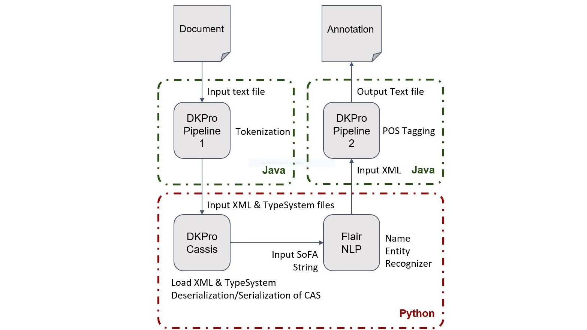

# Proof of Concept of FlairNLP Named Entity Recognition integration with DKPro-Core

DKPro Core is Java based and it integrates taggers e.g. StanfordNLP, OpenNLP etc., where as the Flair is Python based state-of-the-art NLP model. This PoC shows the process of connecting the Java based DKPro Core and Python based Flair together using a middleware DKPro-Cassis. Below are the short descriptions of the technologies that have been used to complete the Proof of Concept.

[DKPro Core](https://dkpro.github.io/dkpro-core/info/):

> DKPro Core addresses tasks that are commonly referred to as linguistic pre-processing, e.g. part-of-speech taggers, parsers, etc. Within DKPro Core, a steadily growing set of third-party tools for such tasks have been wrapped into interoperable and interchangeable components for the Apache UIMA framework.

[FlairNLP](https://github.com/flairNLP/flair):

> Flair is a powerful NLP library. Flair allows you to apply our state-of-the-art natural language processing (NLP) models to your text, such as named entity recognition (NER), part-of-speech tagging (PoS), sense disambiguation and classification.

[DKPro-Cassis](https://github.com/dkpro/dkpro-cassis):
> DKPro-Cassis is a pure-Python implementation of the Common Analysis System (CAS) as defined by the UIMA framework. The CAS is a data structure representing an object to be enriched with annotations (the so-called Subject of Analysis, short SofA).

## Demo version

An example of the use case can be found under ``Example/dkpro_flairnlp_ner_poc.ipynb``

## System requirements

- Python >= 3.6

## Installation Guide

A complete installation guide for both Windows and Linux users can be found [here](doc/INSTALL.md).
    
## Features

- Using DKPro Cassis to annotate Flair NLP NER-tags
- Re-useable CAS object for further annotations in Java based DKPro-Core

## Workflow and Usage

In order to complete this PoC, three files were needed:
- 2 Java files
    - Tokenizer (it outputs XMI and TypeSystem files)
    - POS-Tagger (it takes Flair XMI file as input and outputs annotated XMI file)
- 1 Jupyter Notebook file (it takes CAS object as input, executes Flair NER and annotates the CAS object with NER-tags)

A detailed description of the workflow and usage can be found [here](/doc/USAGE.md)

## Acknowledgement

- [Piush Aggarwal](https://www.ltl.uni-due.de/team/piush-aggarwal)