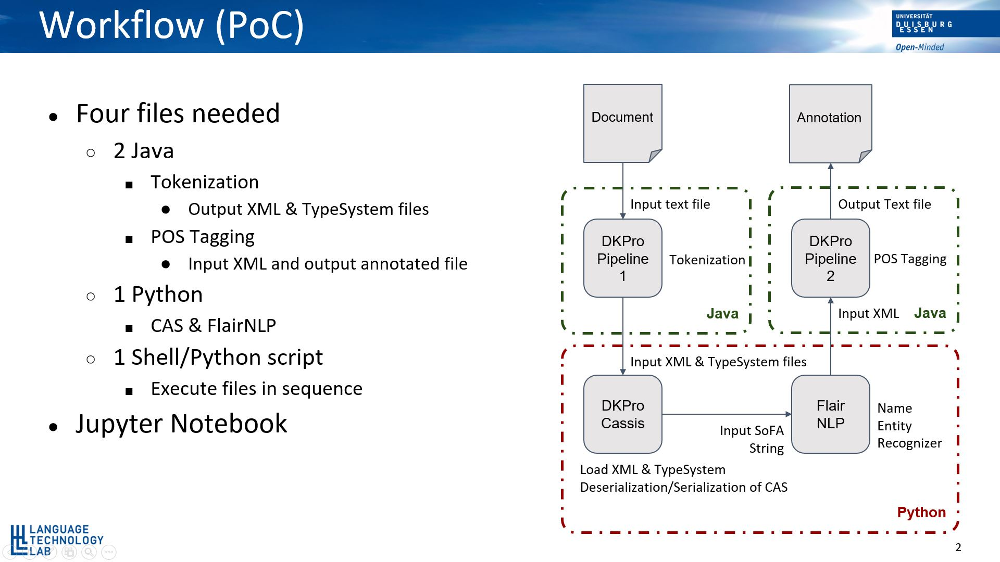

# PoC of FlairNLP Named Entity Recognition integration with DKPro

DKPro Core is Java based and it integrates taggers e.g. StanfordNLP, OpenNLP etc., where as the Flair is Python based state-of-the-art NLP model. This PoC shows the process of connecting the Java based DKPro Core and Python based Flair together using a middleware DKPro-Cassis.

[DKPro Core](https://dkpro.github.io/dkpro-core/info/):

> DKPro Core addresses tasks that are commonly referred to as linguistic pre-processing, e.g. part-of-speech taggers, parsers, etc. Within DKPro Core, a steadily growing set of third-party tools for such tasks have been wrapped into interoperable and interchangeable components for the Apache UIMA framework.

[Flair](https://github.com/flairNLP/flair):

> Flair is a powerful NLP library. Flair allows you to apply our state-of-the-art natural language processing (NLP) models to your text, such as named entity recognition (NER), part-of-speech tagging (PoS), sense disambiguation and classification.

[DKPro-Cassis](https://github.com/dkpro/dkpro-cassis):
> DKPro-Cassis is a pure-Python implementation of the Common Analysis System (CAS) as defined by the UIMA framework. The CAS is a data structure representing an object to be enriched with annotations (the so-called Subject of Analysis, short SofA).

In order to complete this PoC, four files were needed:
- 2 Java files
    - Tokenizer
        - Outputs XMI and TypeSystem files
    - POS-Tagger
        - Takes Flair XMI file as input
        - Outputs annotated XMI file
- 1 Python file
    - Takes CAS object as input
    - Executes Flair NER
    - Annotates the CAS object with NER-Tags

The right side of the above slide is the workflow of the PoC. The steps of the workflow is as follows:
- DKPro Core is used to tokenize the document e.g. using [OpenNLPSegmenter](https://dkpro.github.io/dkpro-core/releases/1.9.0/docs/component-reference.html#engine-OpenNlpSegmenter) and create the CAS objects and TypeSystem
- The CAS object and the TypeSystem files are loaded by DKPro-Cassis
- SoFA string is extracted as input and annotated by the FlairNLP
- The NER annotations were mapped according to the [DKPro Named Entity Recognizer](https://dkpro.github.io/dkpro-core/releases/1.9.0/docs/component-reference.html#_named_entity_recognizer) annotations
- The new CAS annotation is added, which the DKPro can read back to annotate further
- The new CAS object is passed to the next DKPro Core component

