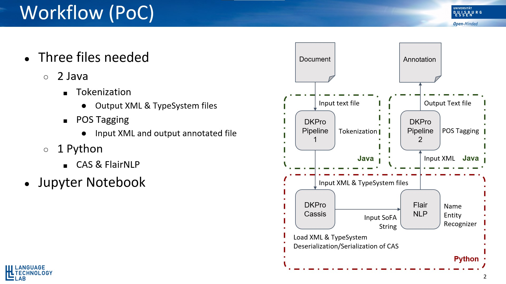

# Detail Workflow and Usage

## Introduction

Figure 1 shows the workflow of the Proof of Concept for the integration of FlairNLP NER-tagger to the DKPro-Core.

The steps of the workflow is as follows:
- DKPro Core is used to tokenize the document e.g. using [OpenNLPSegmenter](https://dkpro.github.io/dkpro-core/releases/1.9.0/docs/component-reference.html#engine-OpenNlpSegmenter) and create the CAS objects and TypeSystem
- The CAS object and the TypeSystem files are loaded by DKPro-Cassis
- SoFA string is extracted as input and annotated by the FlairNLP
- The NER annotations were mapped according to the [DKPro Named Entity Recognizer](https://dkpro.github.io/dkpro-core/releases/1.9.0/docs/component-reference.html#_named_entity_recognizer) annotations
- The new CAS annotation is added, which the DKPro can read back to annotate further
- The new CAS object is passed to the next DKPro Core component



<p style="text-align: center;">Figure 1. Workflow of Proof of Concept</p>

## Workflow in detail

Step 1:

> A document file with multiple line text is created, which will be passed to the first pipeline. An example of the document file can be found in the 
```data/document.txt```

Step 2:

> The first pipeline consist of the DKPro-Core tokenizer. The bottom code snippet is from the DKPro-Core, which uses the OpenNLPSegmenter to create the CAS Object and the TypeSystem.

DKPro Pipeline 1
```
public class Pipeline {

    public static void main(String[] args) throws Exception {
    
        String text_doc = "document.txt";;
            
        runPipeline(
            // Read the document.txt file
            createReaderDescription(TextReader.class,
                TextReader.PARAM_SOURCE_LOCATION, text_doc,
                TextReader.PARAM_LANGUAGE, "en"),
            
            // Initiate the OpenNLPSegmenter from DKPro-Core
            createEngineDescription(OpenNlpSegmenter.class),

            // Create the Cas object and typesystem files        
            createEngineDescription(XmiWriter.class,
                XmiWriter.PARAM_TARGET_LOCATION, "OpenNlpSegmenter.xmi",
                XmiWriter.PARAM_TYPE_SYSTEM_FILE, "TypeSystem_xml")
    }
}
```
Step 3:

Here it shows how the FlairNLP is used to annotate the CAS object generated from the DKPro Pipeline 1

> Open the notebook from the ```Example``` folder by typing the following commands
```
    cd \Example
    jupyter notebook
```

> Copy the generated files (CAS Object and TypeSystem files) and paste them into the ```data``` folder. Insert the name of those files under the following code snippet shown below as an example.

```
typeSystemFile = './data/TypeSystem.xml'
casFile = './data/output_OpenNlpSegmenter.xmi'

segmenter = "de.tudarmstadt.ukp.dkpro.core.api.segmentation.type.Token"

# Load Typesystem
with open(typeSystemFile, 'rb') as f:
    typesystem = load_typesystem(f)

# Load Cas
with open(casFile, 'rb') as f:
    cas = load_cas_from_xmi(f, typesystem=typesystem)
```

> The text in the document can be checked by typing the following command
```
text = cas.sofa_string
print(text)
```

> The Flair NLP is used to predict the NER-Tags on the text
```
model_name = 'ner'
text = Sentence(text)
nlp = SequenceTagger.load(model_name)
nlp.predict(text)
```
> Then the FlairNLP Pipeline is instantiated by the following code snippet
```
NERType = cas.typesystem.get_type("de.tudarmstadt.ukp.dkpro.core.api.ner.type.NamedEntity")

for span in text.get_spans('ner'):
    if span.tag == 'PER':
        val = 'person'
    if span.tag == 'LOC':
        val = 'location'
    if span.tag == 'ORG':
        val = "organization"
    if span.tag == 'MISC':
        val = "miscellaneous"
    ner_annotation = NERType(begin=span.start_pos,
                             end=span.end_pos,
                             value=val)
    cas.add_annotation(ner_annotation)
```

Step 4:

> The annotated CAS is written into an xmi file
```
cas.to_xmi('./data/output_FlairNER.xmi', pretty_print=True)
```
Step 5:
> The CAS object is passed to the second DKPro-Core Pipeline. The second pipeline consists of the Parts-of-Speech Tagger from Java based DKPro-Core OpenNlpPosTagger.

DKPro Pipeline 2
```
public class Pipeline {

    public static void main(String[] args) throws Exception {

        String in_xmi = "flairNLP.xmi";

        runPipeline(
            createReaderDescription(XmiReader.class,
                XmiReader.PARAM_SOURCE_LOCATION, in_xmi,
                XmiReader.PARAM_LANGUAGE, "en"),
            
            createEngineDescription(OpenNlpPosTagger.class),
            
            createEngineDescription(XmiWriter.class,
                XmiWriter.PARAM_TARGET_LOCATION, "OpenNlpPosTagger.xmi")
    }
}
```